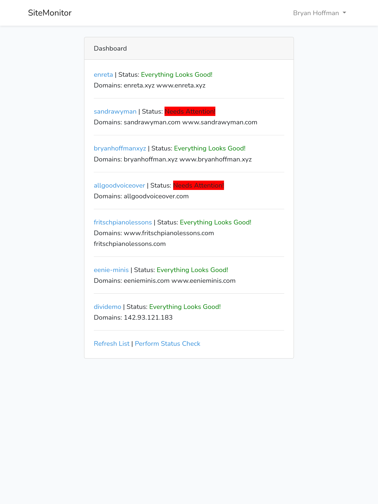

# site-monitor

Monitor your ServerPilot applications 

This app works with the ServerPilot API. To connect, you will need to edit your .env to contain the client id and api key. An example is available in .env.example for you to use while getting started.
